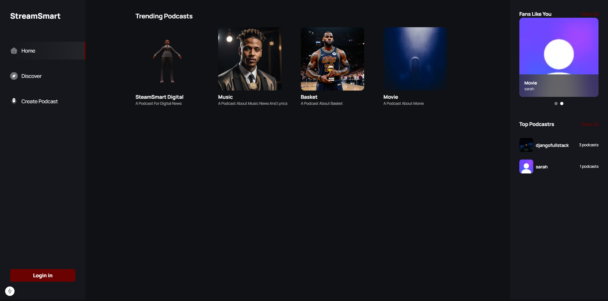
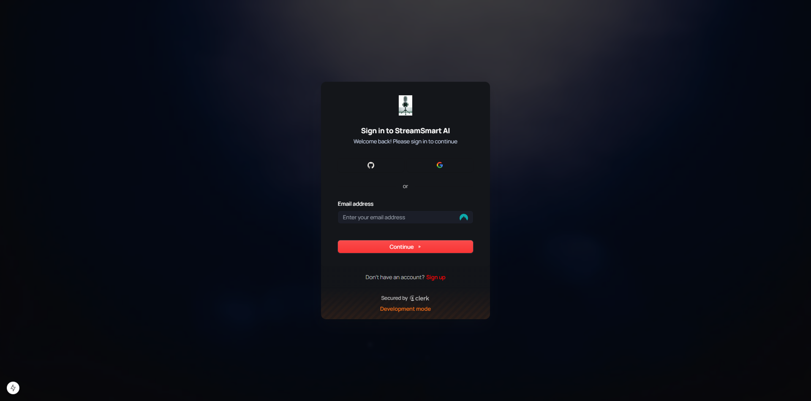
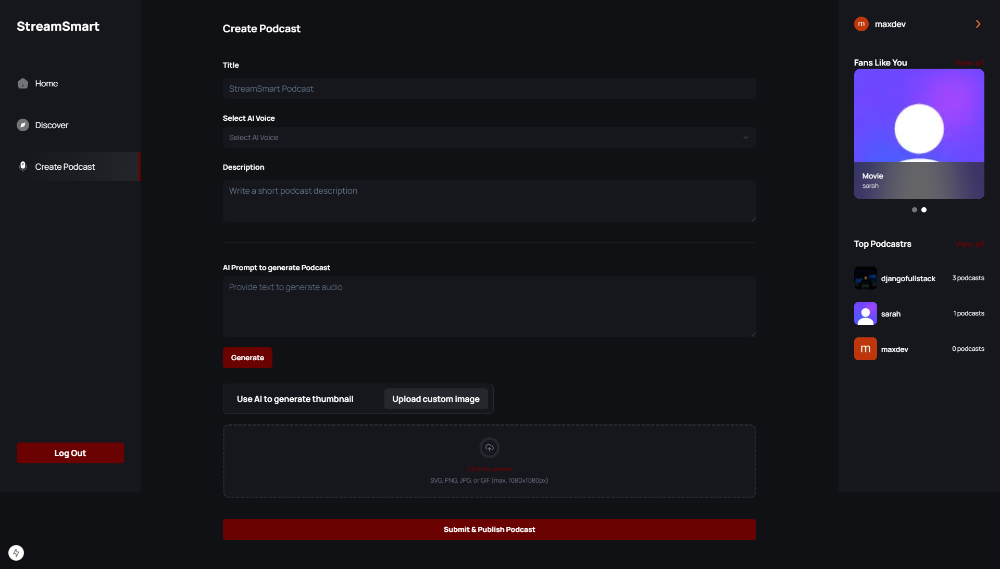
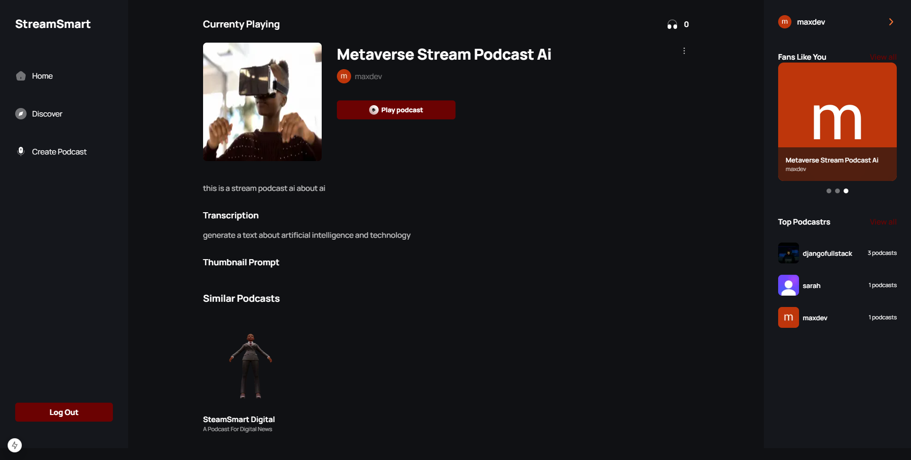
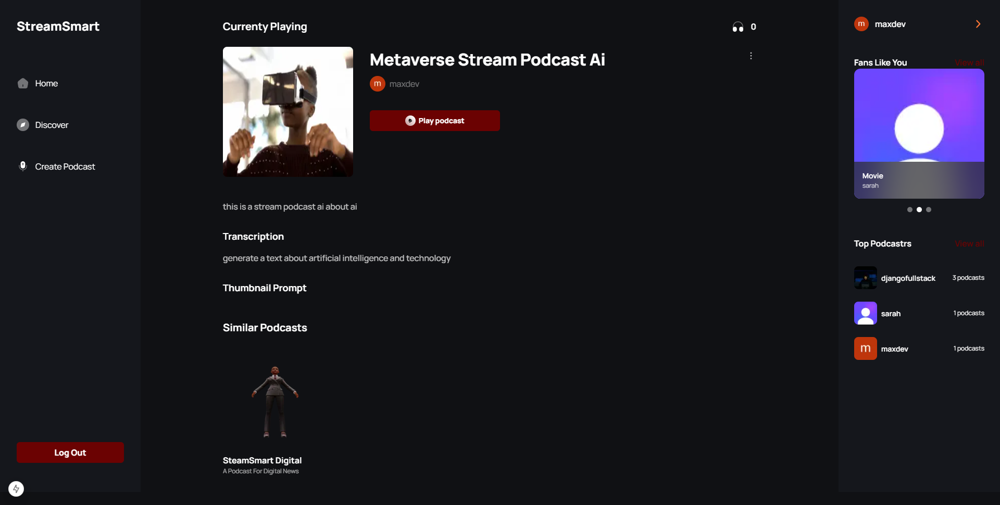
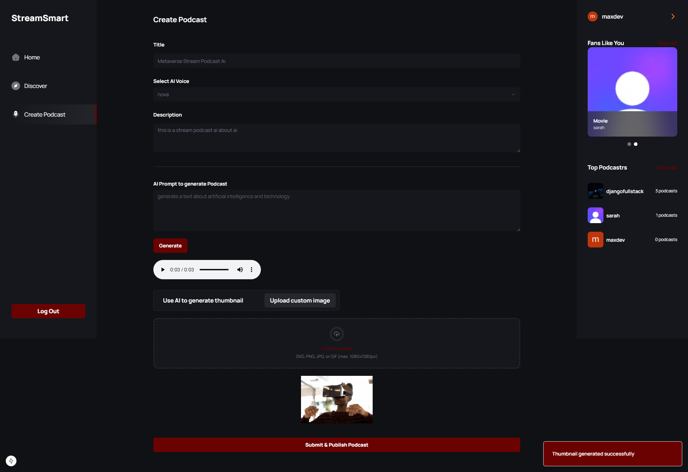
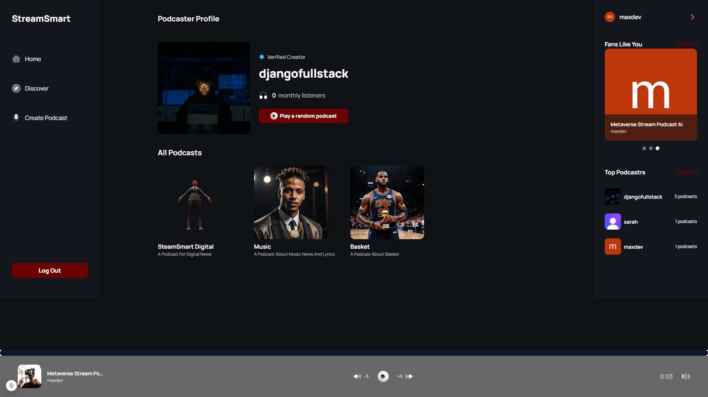
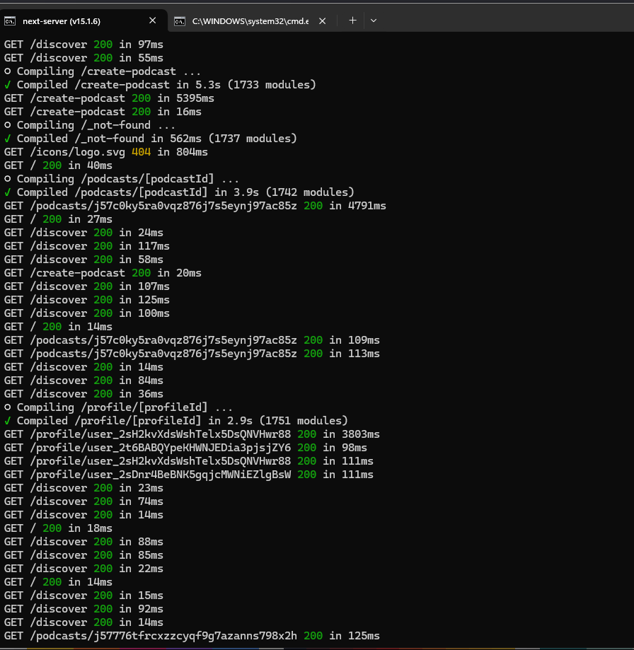

<h1>StreamSmart PodCast AI App Project</h1>

StreamSmart PodCast AI is an innovative SaaS platform designed to streamline podcast creation with the help of artificial intelligence 🎬
With StreamSmart PodCast AI, creating professional-quality podcasts becomes effortless, allowing you to focus on delivering great content to your audience.

<h1></h1>
<h1>StreamSmart PodCast AI Key Features include</h1>
This project is a fullstack Software-as-a-Service app with AI-powered features like text-to-multiple-voices functionality and AI-generated images with Next.js for the frontend.
 Key features include in this project are:
•	AI-Powered Voice Generation: Create natural-sounding podcast episodes using a variety of AI-generated voices or clone your own voice for consistency.
•	Automated Scripting: Generate engaging podcast scripts based on your topics and outlines, ensuring rich and informative content.
•	Image Generation: create relevant images and visuals to complement your podcast episodes.
•	Content Structuring: Automatically split long-form content into multiple episodes while maintaining context and flow.
•	Editing Tools: Access automated editing features to enhance your podcast's audio quality and flow.
•	Collaboration: Invite colleagues or clients to collaborate on podcast projects, providing real-time feedback and approvals within the platform.

<h1></h1>
<h1>StreamSmart PodCast AI Screen</h1>

This section would allow users to easily navigate through different screen, helping them find exactly podcast stream they're looking for in the app based on their needs and interests. 

   <h1>Homepage </h1>
   

   <h1></h1>
   <h1>Authentication</h1>
   

  <h1></h1>
  <h1>Create Podcast Page</h1>
  

  <h1></h1>
    <h1>Generate Podcast</h1>
     <h1>Generate Thumbnail</h1>
   
   
  <h1></h1>
   <h1>Postcastcreate Page</h1>
    
 

   <h1></h1>
   <h1>Displaying Podcasts</h1>
   

   <h1></h1>
   <h1>Podcast Details Page</h1>
    

  
  <h1></h1>
  <h1>Podcast Player</h1>
    

  

<picture>
  <source media="(prefers-color-scheme: dark)" srcset="https://raw.githubusercontent.com/tobiasmeyhoefer/tobiasmeyhoefer/output/github-snake-dark.svg" />
  <source media="(prefers-color-scheme: light)" srcset="https://raw.githubusercontent.com/tobiasmeyhoefer/tobiasmeyhoefer/output/github-snake.svg" />
  
</picture>

